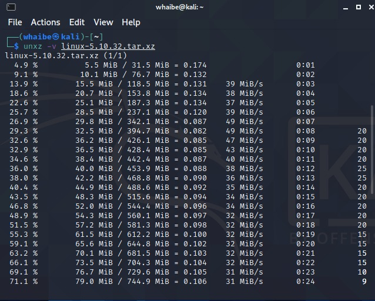
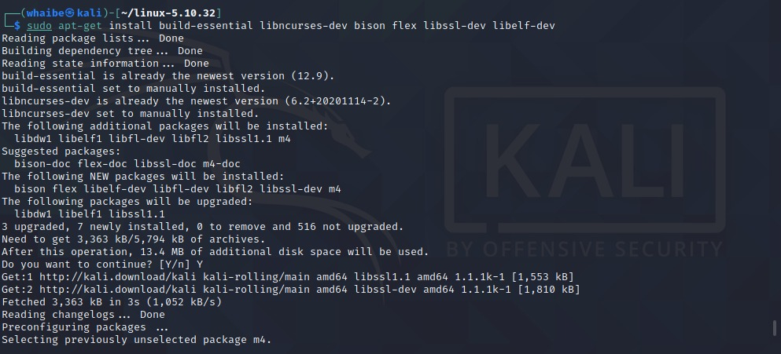
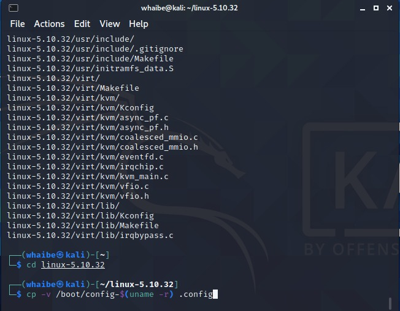
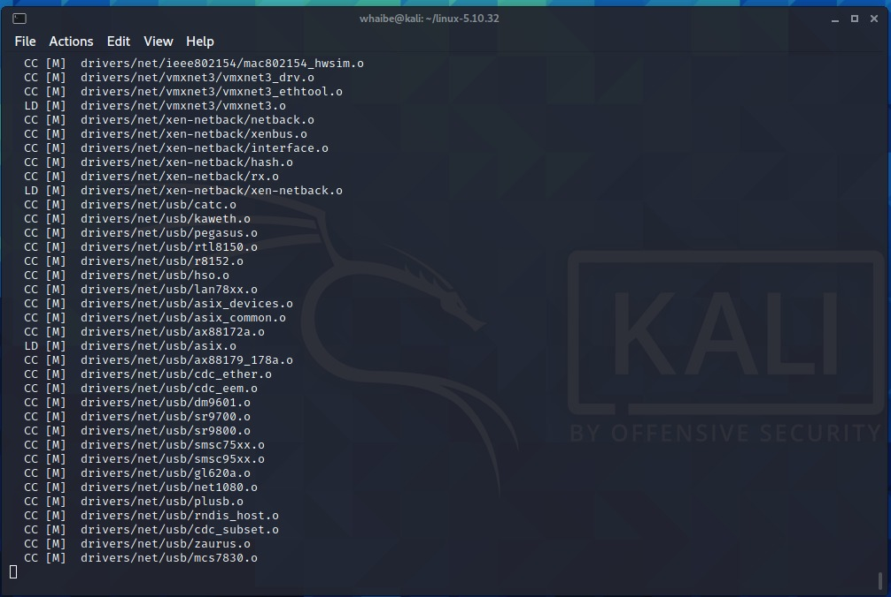

# How to compile and install Linux Kernel

0. Check existing kernel version

```
uname -mrs
```
 


1. Download the selected kernel version source code

1.1 Check which version you want to download from the official kernel project website

1.2 Install *wget* utility to fetch tarball:

```
sudo apt-get install wget
```


1.3 Use the wget command to download Linux kernel source code:

```
wget https://cdn.kernel.org/pub/linux/kernel/v5.x/linux-5.6.9.tar.xz
```


2. Extract tar.xz file

```
unxz -v linux-5.6.9.tar.xz
```



3. Untar the kernel tarball. You can extract the source code in your $HOME directory or any other directory using the following unzx command or xz command:

```
tar xvf linux-5.6.9.tar
```

4. Install the required compilers and other tools. You must have development tools such as GCC compilers and related tools installed to compile the Linux kernel.

```
sudo apt-get install build-essential libncurses-dev bison flex libssl-dev libelf-dev libncurses-dev
```




5. Configure the Linux kernel features and modules

5.1 Before start building the kernel, one must configure Linux kernel features. You must also specify which kernel modules (drivers) needed for your system. The task can be overwhelming for a new user. I suggest that you copy existing config file using the cp command:

```
cd linux-5.6.9
cp -v /boot/config-$(uname -r) .config
```



6. Compile and build Linux kernel

```
make -j $(nproc)
```



7. Install Linux kernel and modules (drivers)

7.1 Install the Linux kernel modules

```
sudo make modules_install
```

7.2 Install the Linux kernel. So far we have compiled the Linux kernel and installed kernel modules. It is time to install the kernel itself:

```
sudo make install
```

It will install three files into /boot directory as well as modification to your kernel grub configuration file:

- initramfs-5.6.9.img
- System.map-5.6.9
- vmlinuz-5.6.9

8.  Update Grub configuration. You need to modify Grub 2 boot loader configurations.

```
sudo update-initramfs -c -k 5.6.9
sudo update-grub
```

9. Reboot the system

```
sudo reboot
```

10. Check new kernel version

```
uname -mrs
```