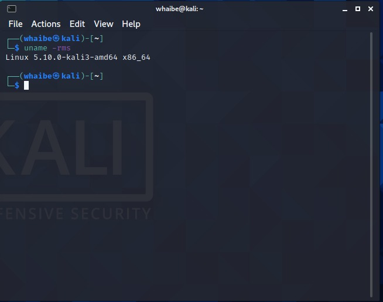
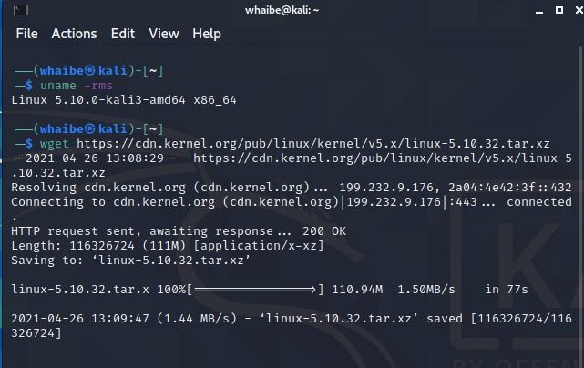

# How to compile and install Linux Kernel

0. Check existing kernel version

```
uname -mrs
```
 


1. Download the selected kernel version source code

1.1 Check which version you want to download from the official kernel project website

1.2 Install *wget* utility to fetch tarball:


sudo apt-get install wget


1.3 Use the wget command to download Linux kernel source code:


wget https://cdn.kernel.org/pub/linux/kernel/v5.x/linux-5.6.9.tar.xz



